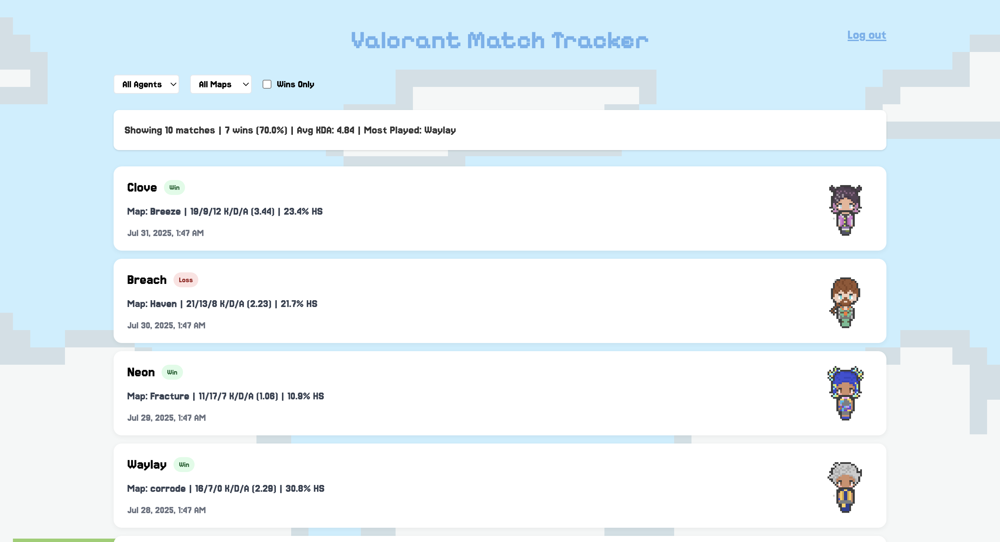
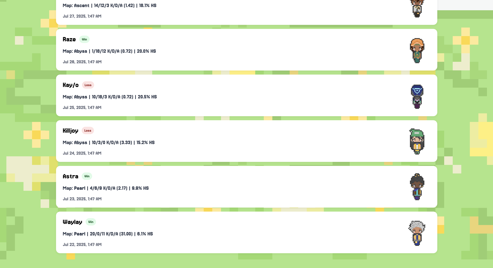
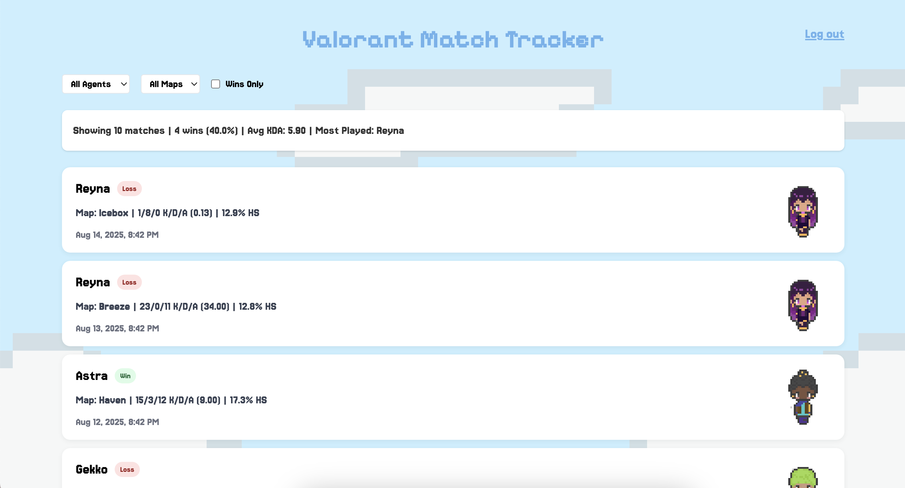
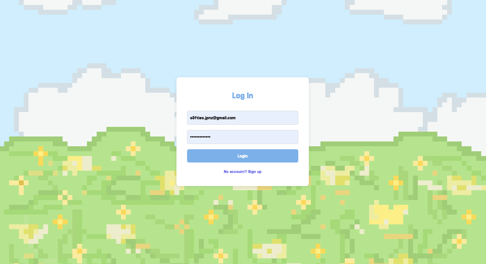

## Valorant Match Tracker – VALODASH

A full-stack, self-contained Valorant stats tracker with custom-generated match data.
Since Riot’s Valorant API isn’t public, I engineered my own backend to generate realistic mock match histories for each new user. Using Firebase Auth, the app creates unique match data (agents, maps, KDA, headshot rates) the moment a user signs up — no manual setup needed.
Built with React + TypeScript on the frontend, Node.js + Express on the backend, and custom pixel-art assets drawn by me for agents and backgrounds. Fully responsive and designed for quick, interactive stat viewing.

## Features

1. Authentication: Firebase Email/Password login system.
2. Dynamic Mock Data: New users automatically get a generated match history. Data includes agents, maps, kills/deaths/assists, win/loss, and realistic headshot percentages (weighted toward 15–25% for realism).
3. Custom Assets: Pixel-art backgrounds and agent icons drawn by me.
4. Responsive UI: Works on desktop and mobile.
5. Stat Summaries: Average KDA, win rates, most-played agents, and more.
6. Interactive Match Cards: Shows match details, headshot rates, and agent icon for each game.

## Tech Stack

1. Frontend - React (Vite), TypeScript, Tailwind CSS
2. Backend - Node.js / Express, File-based JSON data store
3. Other - Firebase Authentication, Custom pixel-art assets

## How my project works

1. User signs up → Firebase UID is generated.
2. Backend checks for a saved data file:
3. If found → loads existing matches.
4. If not → generates mock matches using a weighted random system.
5. Data is sent to the frontend and displayed in a sortable, styled dashboard.

## Screenshots

### Match History Page

### Login Page

